## Background

The Online Restaurant Management System is a Java based application.It enables managers and staff to carry out their activities with ease. The staff can show menu, manage orders, generate reports.  The managers in addition to this can also manage staff by creating, updating or deleting employee records.

## Core Functionalities and User Flow
The application provides the following capabilities to the user. The landing page is the first page the user sees once the application is executed.

The user gets an option to login as a manager or as an employee.

***User Flow 1:*** The logged in user is a manager

Post successful login, the manager is able to access the application.

He is able to see the entire menu, along with the options to manage the menu, by adding, editing or deleting a menu item

He can also manage the staff, by adding new employee details, editing existing ones and deleting the staff who has left their job at the restaurant.

***User Flow 2:*** The logged in user is a staff member

When a staff or employee logs in he is able to see the menu and can also create, view, update and cancel orders

***User Flow 3:*** Staff members order management, create, update ,delete and view orders

Click "New" button to create new order

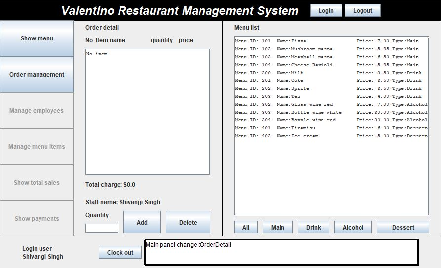

Select adding items by clicking from the menu list on the right side. Enter quantity and click "Add" button on the left side.(If quantity is empty, one item will be added). The user can go back to the main screen to view order. He can update the same from the main menu.

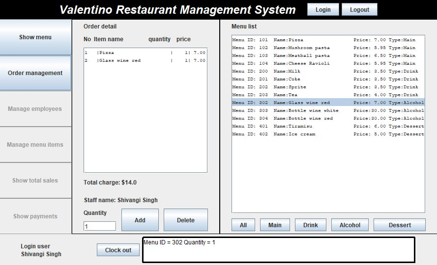

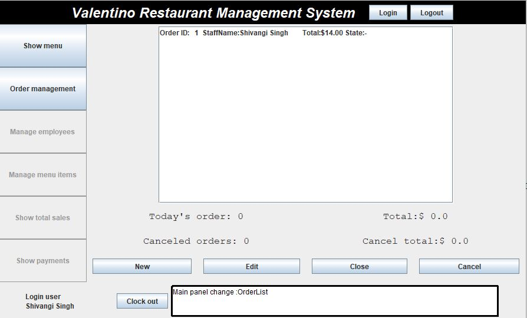

The order can be closed once served

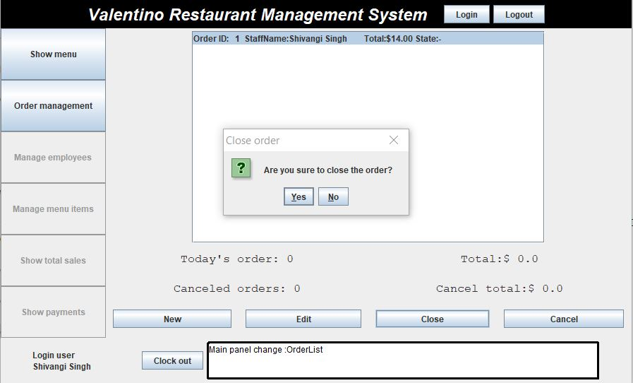

The user can similarly cancel orders

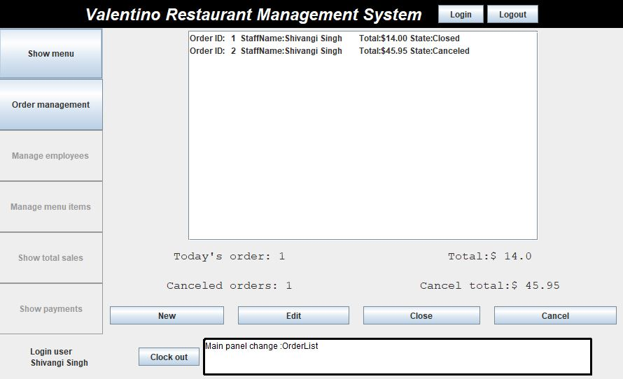

***User Flow 5:*** Manager adds, edits and removes a staff member

To add new staff click "Manage Employees" Button on the left and then click "New" button followed by filling the information and click ok

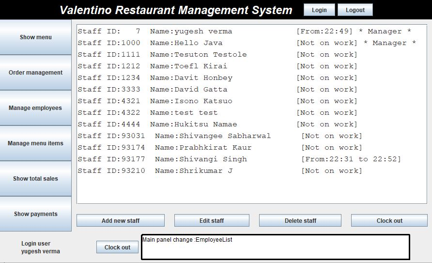

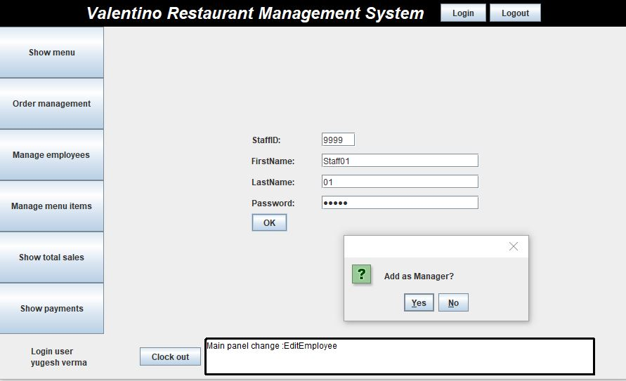

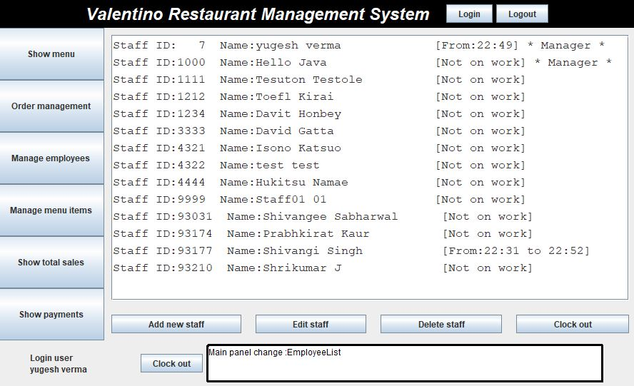

Similary the manager can remove a staff member

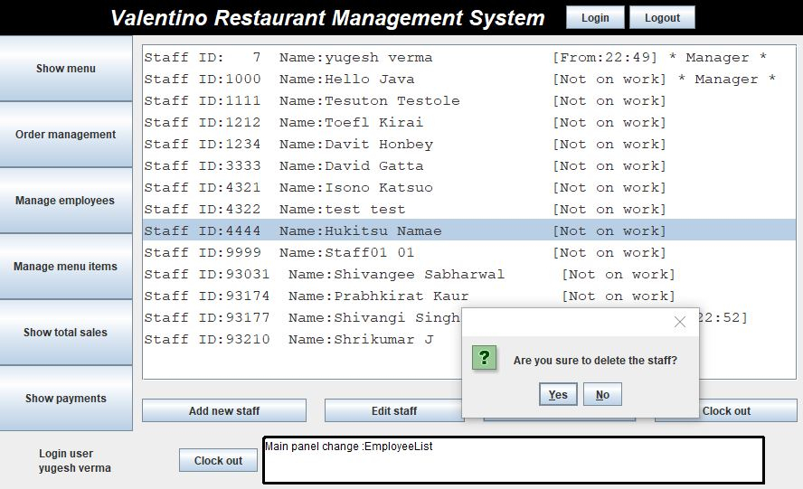

***User Flow 6:*** The logged in user manages menu items

To add new item click "Manage menu items" Button on the left and click "Add new menu item" button and fill in all information and click OK

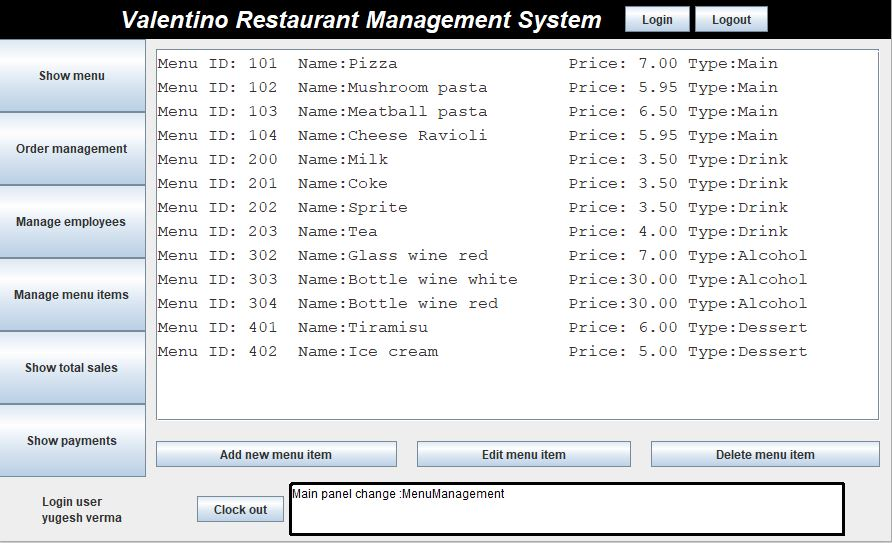

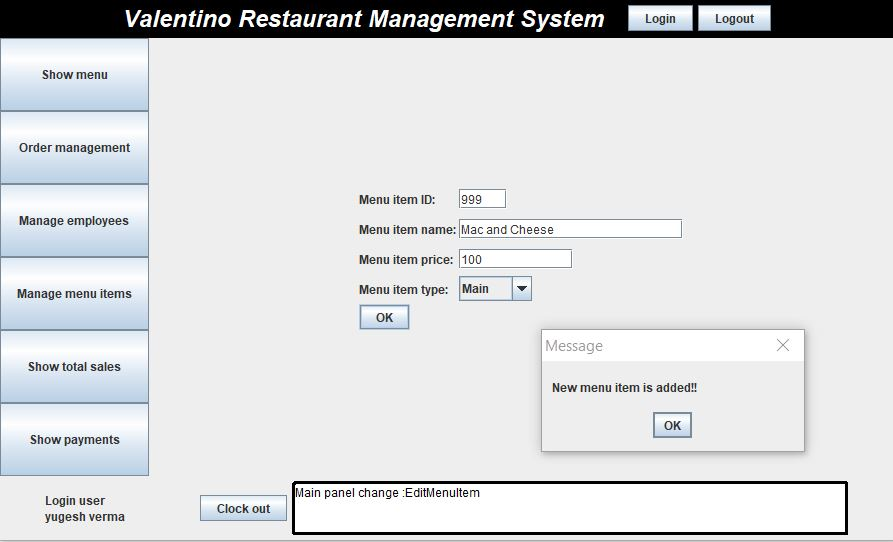

To click "Manage menu items" Button on the left and select a menu item from the menu list click "Delete menu item" button

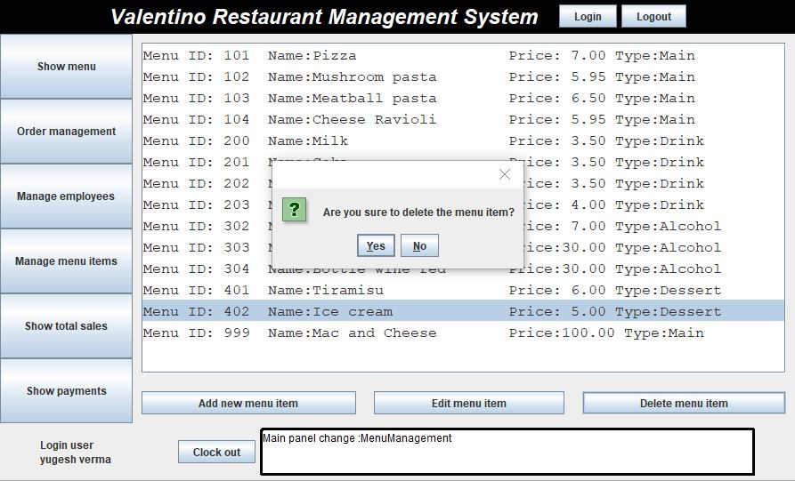

***User Flow 7:*** The logged in user checks total sales and payments

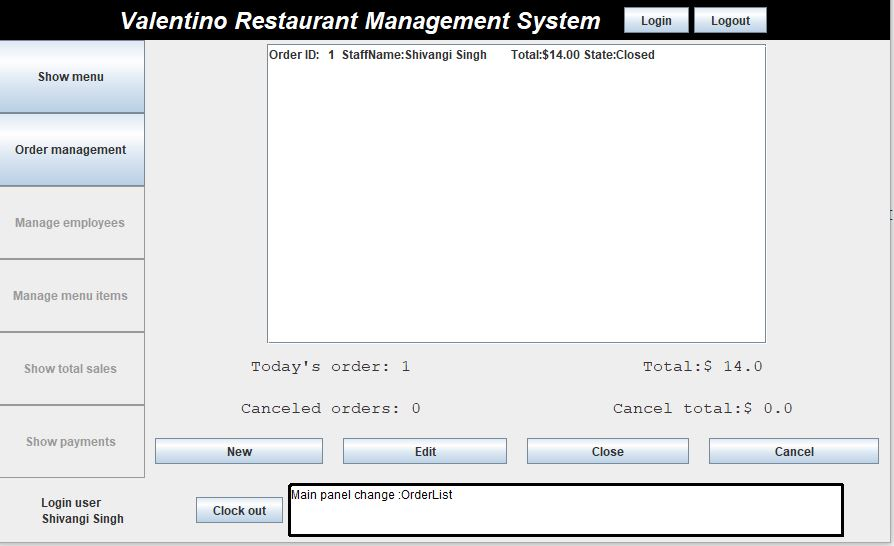

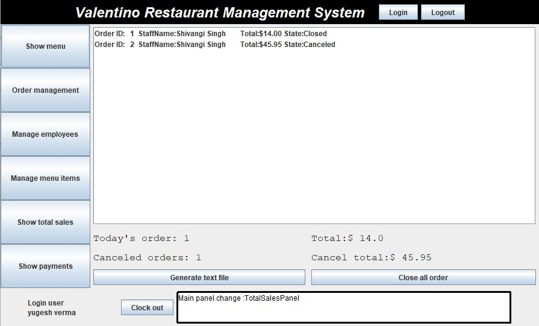

When you log in, the system automaticaly set start working time.
Clock out button will set finish working time of the person currently logged in.
Manager can make staff clocked out via manage employees, by selecting staff and clicking Clock out button.
You can see a payment details for a day by clicking "Show payment" button on the left

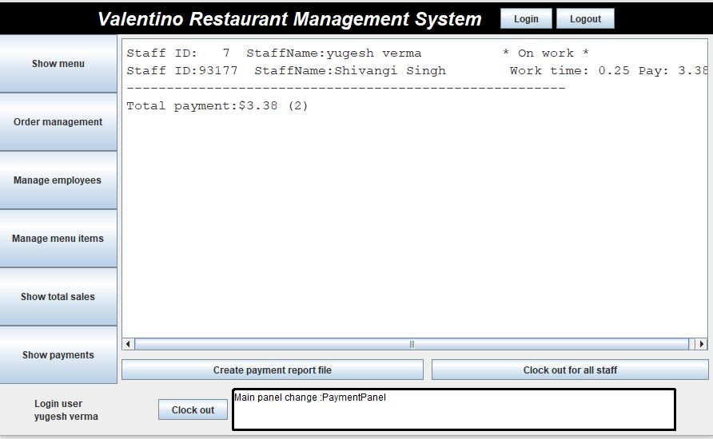

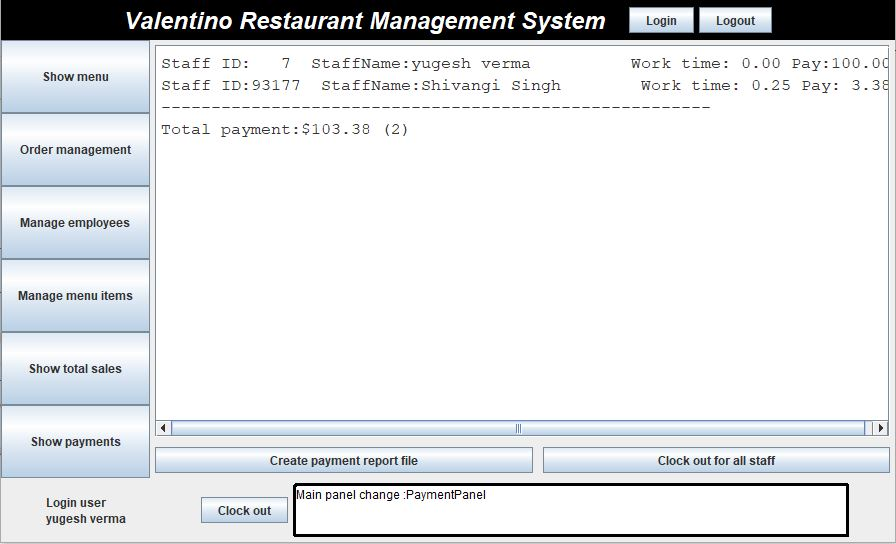

## Value Proposition

