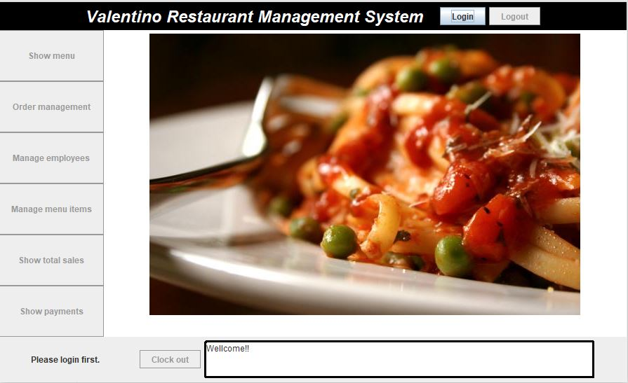
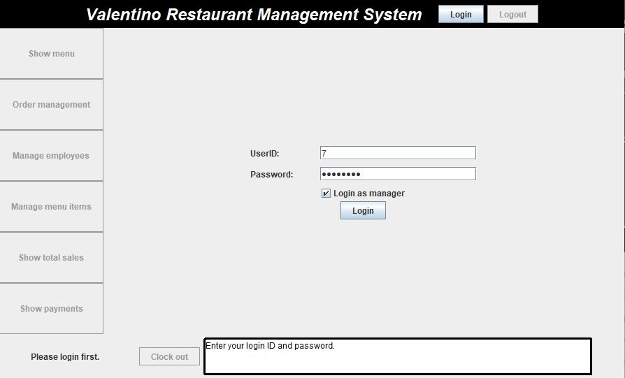
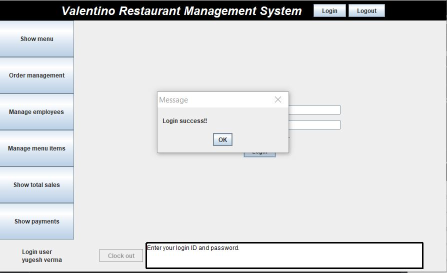
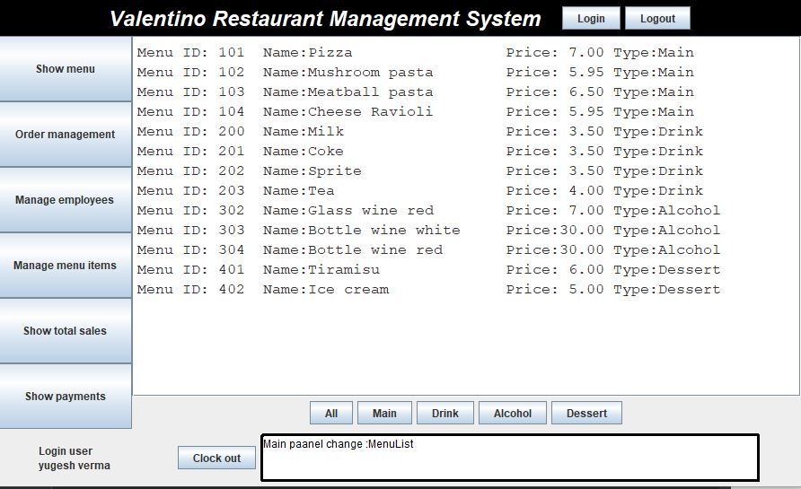
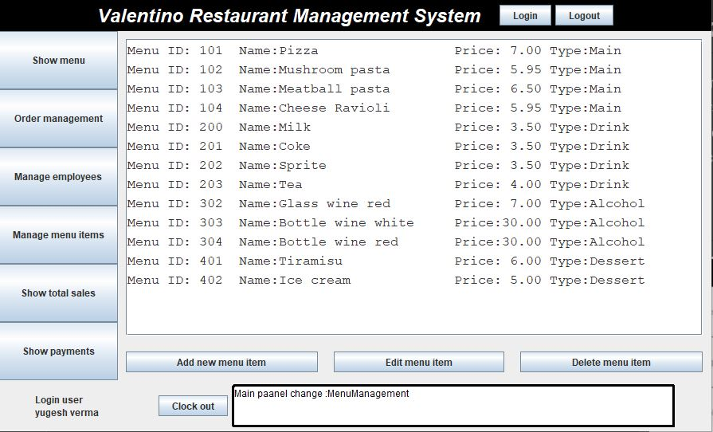
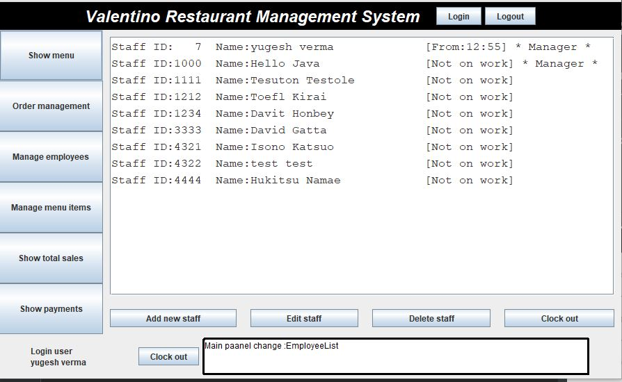
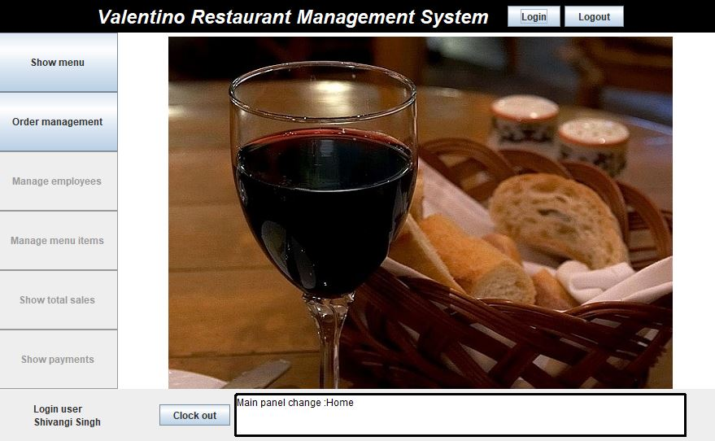
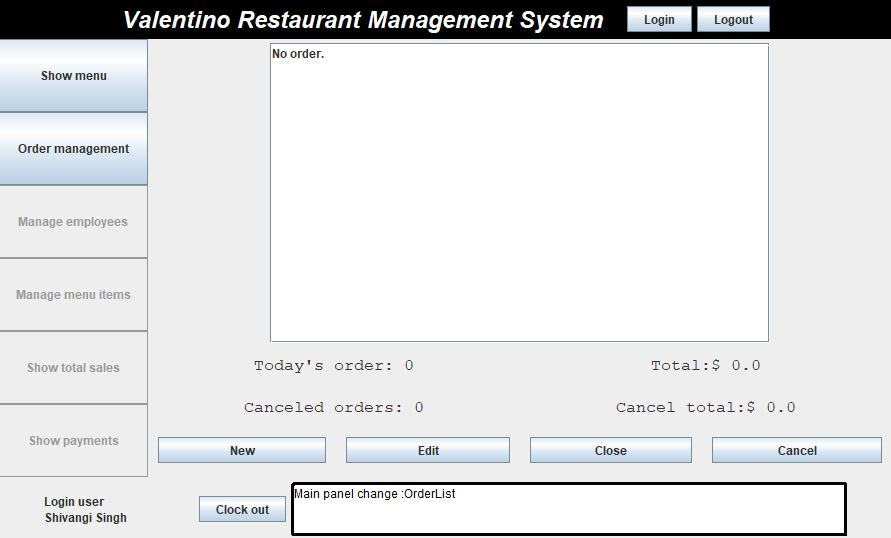

## Background

The Online Restaurant Management System is a Java based application.It enables managers and staff to carry out their activities with ease. The staff can show menu, manage orders, generate reports.  The managers in addition to this can also manage staff by creating, updating or deleting employee records.

## Core Functionalities and User Flow
The application provides the following capabilities to the user. The landing page is the first page the user sees once the application is executed.

The user gets an option to login as a manager or as an employee.

***User Flow 1:*** The logged in user is a manager

Post successful login, the manager is able to access the application.

He is able to see the entire menu, along with the options to manage the menu, by adding, editing or deleting a menu item

He can also manage the staff, by adding new employee details, editing existing ones and deleting the staff who has left their job at the restaurant.

***User Flow 2:*** The logged in user is a staff member

When a staff or employee logs in he is able to see the menu and can also create, view, update and cancel orders

***User Flow 3:*** Manager adds, edits and removes a staff member

***User Flow 4:*** The logged in user manages menu items

***User Flow 5:*** The logged in user checks total sales

***User Flow 6:*** The logged in user checks the status of payments

## Value Proposition

